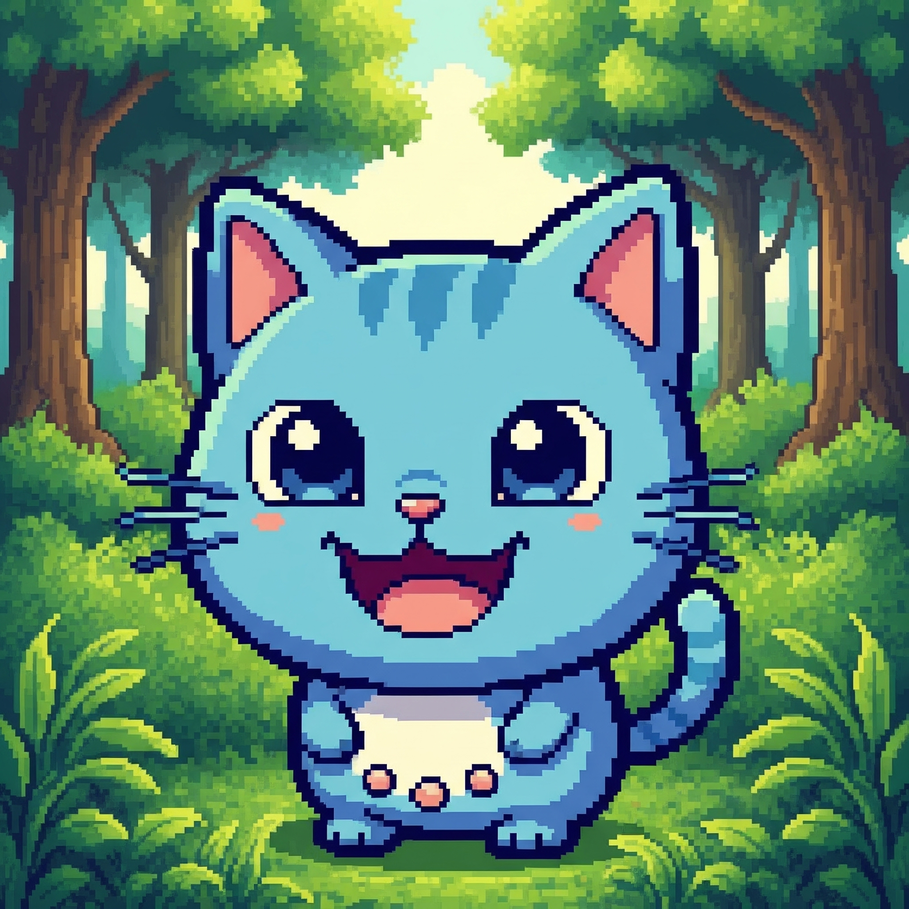

# 🐾 Tamagotchi App in Streamlit

Welcome to **Tamagotchi Game**, a virtual pet game built in **Python** using **Streamlit**. This project was created to practice **Object-Oriented Programming (OOP)**, interactive UI logic, and deployable web apps using modern Python tools.

> Feed it, play with it, clean it, and help it rest. But be careful: if it gets too hungry, bored, dirty or tired... it's **GAME OVER** 💀

---

## 📸 Preview

 <!-- Cambia esto si subes una captura del juego -->

---

## 🎮 How to Play

- 🍽️ **Eat**: Reduce hunger  
- 🎮 **Play**: Reduces boredom (Rock-Paper-Scissors game!)  
- 🛁 **Bath**: Cleans your pet  
- 😴 **Sleep**: Lowers tiredness  
- 🍖 **Search for Food**: Find more meals  
- ⚠️ If any stat reaches 10 → your pet dies!

You’ll see images depending on your pet’s mood. The stats update dynamically with each action.

---

## 🚀 How to Run Locally

1. **Clone the repo**

```bash
git clone https://github.com/tu_usuario/tamagotchi.git
cd ../tamagotchi 
```

2. **Create a virtual environment**

```bash
python -m venv venv
source venv/bin/activate  # or .\venv\Scripts\activate in Windows 
```

3. **Install dependencies**

```bash
pip install -r requirements.txt
```

4. **Run the app**

```bash
streamlit run app.py
```

You’ll see the app open in your browser at http://localhost:8501

## 🚀 Run it in Streamlit Cloud
https://tamagotchi-amg.streamlit.app/

## 🧱 Project Structure

```bash
tamagotchi/
├── app.py                        # Main Streamlit app
├── config.py                    # Page config (title, layout, favicon, etc.)
├── requirements.txt             # Dependencies
│
├── assets/                      # Images, GIFs, game over screen
│   ├── happy.jpg
│   ├── sad.jpg
│   ├── sleeping.jpg
│   ├── playing.jpg
│   └── almostdead.jpg
├── pages/                       # Additional Streamlit pages
│   └── instructions.py          # How to play and project description
│
├── tamagotchi_module/           # Core logic and OOP code
│   ├── __init__.py
│   ├── tamagotchi.py            # The Tamagotchi class
│   └── functions.py             # Helper functions: menu, load, etc.
```
